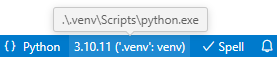
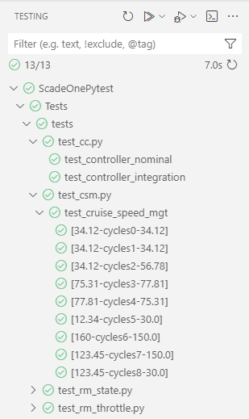
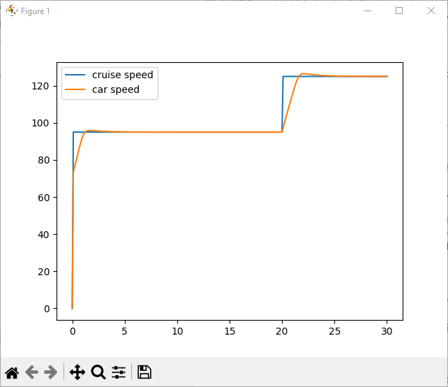
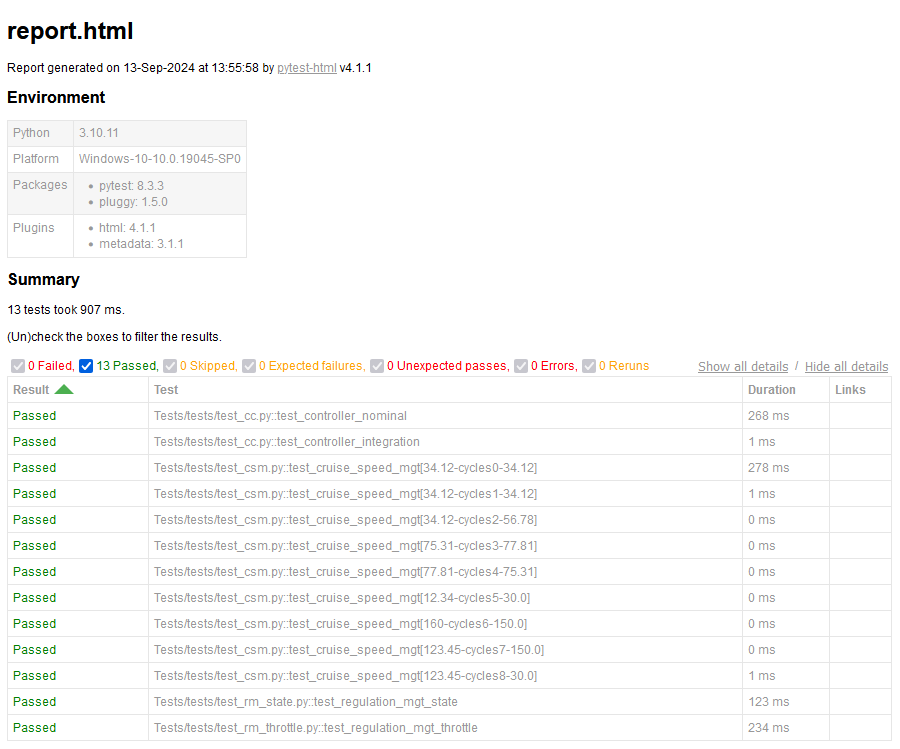

# Testing Scade One Essential models with pytest

## Description

This repository illustrates how to test Scade One Essential models with Python test environments, in particular [pytest](https://docs.pytest.org) within [VS Code](https://code.visualstudio.com/).

It is based on the [Python Wrapper](https://scadeone.docs.pyansys.com/version/dev/examples/wrapper/index.html), which is packaged with [PyScadeOne](https://pypi.org/project/ansys-scadeone-core).

## Installation

1. Access the `scade-one-pytest` directory where the repository has been cloned:

   ```cmd
   cd scade-one-pytest
   ```

2. Create a clean Python virtual environment and activate it:

   a. For Command Prompt, use:

   ```cmd
   python -m venv .venv
   .venv\Scripts\activate.bat
   ```

   b. For PowerShell, use:

   ```ps
   python -m venv .venv
   .venv\Scripts\Activate.ps1
   ```

3. Install the dependencies (Python Wrapper, testing tools, and plotting library):

   ```cmd
   python -m pip install -r tests/requirements.txt
   ```

4. Define the installation folder of Scade One in the file `tests/utils/environment.py`. Originally, the variable `scade_one_install` is set to `C:\Program Files\ANSYS Inc\v252\Scade One`.

## Content

The repository contains the following directories and files:

* `Documents`: Cruise Control Software requirement specifications.
* `CruiseControl`: Scade One model.
* `libscade`: Copy of used library operators so that the project is properly managed under configuration.
* `tests`: Folder containing the test code and utilities.
  * `generate_code.bat` is a batch file to generate all code and proxies needed for the tests.
  * `conftest.py` is a special file for `pytest` to implement some features in test procedures.
  * `test_xxx.py` are the implementation of the test cases.
* `tests\utils`: Utilities for building proxies and generating code.
  * `environment.py` defines the installation directory of Scade One.
  * `build_proxy.py` contains the function to build the Python wrappers (proxies) around the generated C code.
  * `proxies.py` contains fixtures to build and instantiate the proxies for the operators being tested.
  * `generate_code.py` is a script to generate all the code and proxies needed for the tests

## Usage

Open the directory `scade-one-pytest` with VS Code and make sure the Python environment is your local virtual environment. You can do that by opening one of the Python files included in the repository and clicking the bottom-right of VS Code's status bar:



Open the Testing view of VS Code and run the tests.



Notes:

* The last test, `test_regulation_mgt_throttle`, plots the results:

  

  The plot will be shown interactively only if the test is run alone.
  When several tests are executed (batch mode), the plots are saved instead in folder `tests/plots`
   and included in the HTML report.

* The `pytest-html` plugin produces a test report `report.html` in the repository's root directory:

  

* The tests can also be run from a command prompt:

  ```cmd
  cd scade-one-pytest
  pytest tests
  ```

  An additional option `--no-codegen` can be used to skip the code generation step
   if the code and proxies have already been generated: `pytest tests --no-codegen`.

* A batch file `tests\generate_code.bat` is included at the root is provided to generate all code
and proxies without running the tests, after the virtual environment `.venv` has been created.
It can be run from a command prompt:

  ```cmd
  cd scade-one-pytest
  tests\generate_code.bat
  ```

## Customization for your own models

1. Put your model at the root of the repository (next to `tests` folder)
2. Update the file `tests/utils/generate_code.py` accordingly in a similar way (with model path, job names, and output folders)
3. Generate all the code with the file `tests/generate_code.bat`
4. Update the fixtures at the end of the file `tests/conftest.py` according to your model structure and test needs for:

   * building the different proxies needed (with model path, job name, and output folder): see `cc_build_proxy` as an example
   * instantiating the proxy classes to the operators being tested: see `controller` as an example.

     **NOTE**: The names of the classes to be instantiated can be found in the generated `proxy` folder, and correspond to the
     naming convention `<Operator>_<ModuleWithUnderscores>` (e.g., `AA:BB:MyOperator` becomes `MyOperator_AA_BB()`).

5. Create your test cases as `tests/test_xxxx.py` files using the instantiated proxy classes.
   The test functions shall use the names of the fixtures for proxy classes instances defined in `tests/conftest.py`
   as input parameters: see function `test_controller_nominal` in `tests/test_cc.py` as an example.
